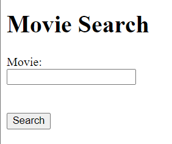
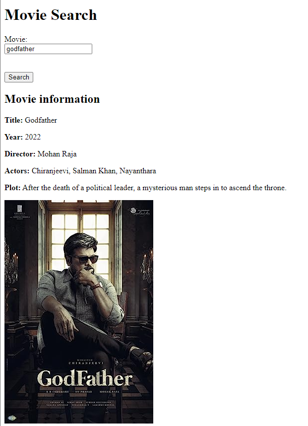

# TALLER 1: APLICACIONES DISTRIBUIDAS (HTTP, SOCKETS, HTML, JS, MAVEN, GIT)
## Buscador de Películas - App web para consultar información de películas de cine.

### Inicialización:
Estas instrucciones te ayudarán a obtener una copia del proyecto en funcionamiento en tu máquina local para desarrollo y pruebas. Consulta la sección de "Despliegue" para obtener notas sobre cómo implementar el proyecto en un sistema en vivo.

### Prerequisitos:
Cosas que necesitas instalar y cómo hacerlo.

- Java Development Kit (JDK)
- Maven
- Git

### Instalando el proyecto:

1. Para tener una copia en local del repositorio debemos abrir la termial y estar ubicado en la carpeta que queremos clonar el repositorio, seguido a esto utilizamos el comando:

```
https://github.com/CamiloCanta/AREP_lab1
```

2. Preferencialmente, solemos abrir el proyecto en una IDE, por lo cual abriremos el proyecto en esta misma, abriremos la terminal y ejecutamos el codigo:
```
mvn exec:java
```
3. Ya ejecutada la aplicación, procedemos a abrir el navegador de nuestra preferencia y usamos la siguiente URL:

```
http://localhost:35000
```
4. Una vez en la página podemos realizar busquedas de las peliculas

5. Así se verá cuando se realice una consulta


### Correr los tests
En nuestra IDE usamos el siguiente codigo para correr las pruebas unitarias:
```
mvn test
```

### Documentación:
Con el siguiente comando veremos la documentación:
```
mvn javadoc:javadoc
```

### Contrucción:
- Java
- Maven
- Git
- OMDAPI - API externa de consulta

### Autor:
Camilo Andres Cantillo Tatis

### Extensibilidad:
1. Incorporando Diferentes Fuentes de Información:

Me gustaría hacer que nuestro buscador de películas sea aún más versátil al permitir que los usuarios obtengan información de diferentes fuentes. En lugar de depender únicamente de una API como OMDB, podríamos diseñar nuestro sistema para que pueda conectarse a otras APIs o incluso a una base de datos interna. Para lograr esto, podríamos crear una estructura modular que admita múltiples proveedores de datos. Cada proveedor podría implementar una interfaz común y se encargaría de recuperar los detalles de las películas de su respectiva fuente. Esto nos brindaría la flexibilidad de agregar fácilmente nuevas fuentes de información en el futuro.

2. Potenciando las Búsquedas Avanzadas:

Una idea que me emociona es expandir nuestra funcionalidad de búsqueda para que los usuarios puedan encontrar películas de manera más precisa. Además de buscar por título, podríamos permitir búsquedas avanzadas por género, año de lanzamiento, director y actores. Esto requeriría que ajustemos nuestra lógica de servidor para manejar diferentes parámetros de búsqueda y generar consultas más específicas. Así, los usuarios podrían encontrar películas que se adapten mejor a sus preferencias y descubrir nuevas joyas cinematográficas de manera más eficiente.


